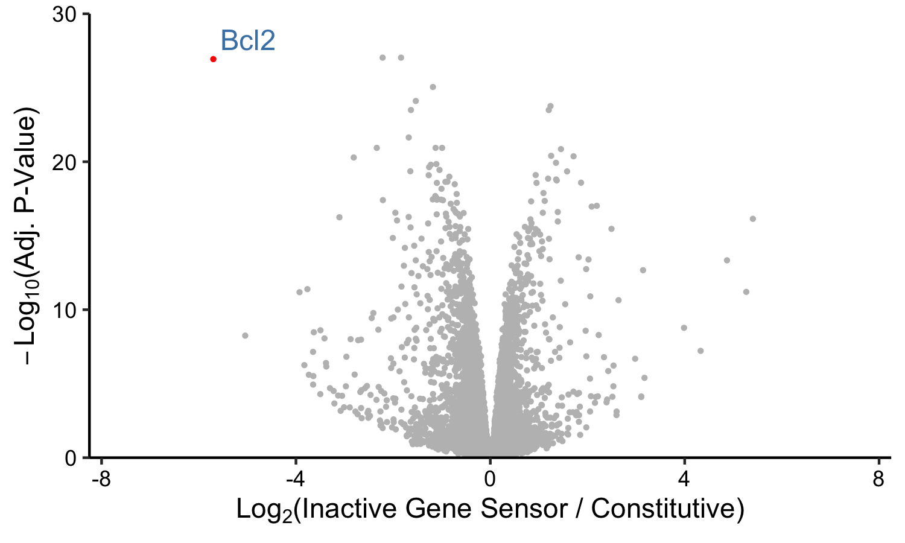

# Investigating the Impact of Gene Sensor on Cellular Transcriptome

## Project Overview

This project investigates the **leakiness** of gene sensor, a synthetic gene circuit, 
in mammalian cells. Leakiness refers to unintended gene expression in the absence of activation. 
An ideal circuit should robustly express Bcl2 when activated, while maintaining minimal expression 
("leakiness") in its inactive state. We used **RNA-seq** to explore the circuit's behavior under these conditions, 
comparing gene expression across three experimental conditions:

- **Wildtype**: un-engineered wildtype CHO cells.
- **Constitutive**: CHO cells engineered to constitutively express Bcl2.
- **Inactive Gene Sensor**: CHO cells transfected with a gene sensor circuit, where the 
sensor gene remains in its inactive state without external activation.

  

**Fig. 1.** Diagram of the gene sensor. Single-guide RNAs (sgRNAs) are engineered and 
inserted into the terminator region of a sensor gene so that the sgRNAs co-express with 
the sensor gene. Under cellular stress, the sgRNA activates anti-apoptotic Bcl2, thereby 
increasing cell survival.

---

## RNA-Seq Analysis Workflow

The RNA-Seq analysis is fully automated using **Snakemake**, which orchestrates the 
following steps:

1. **Preprocessing**: Quality control and trimming of raw reads.
2. **Alignment**: Mapping reads to the reference genome with **HISAT2**.
3. **Feature Counting**: Quantifying gene expression with **featureCounts**.
4. **Differential Expression**: Analyzing differential expression with **edgeR**, 
**limma**, and **DESeq2**.
5. **Visualization**: Generating volcano and jitter plots to visualize results.

  

**Fig. 2.** Overview of the RNA-Seq analysis pipeline.

---

## Getting Started
To run the pipeline, ensure the following tools are installed:

- **Trim Galore** (for trimming)
- **HISAT2** (for alignment)
- **featureCounts** (for quantification)
- **R** (for analysis and visualization)
- **Snakemake** (for workflow management)

Clone the repository and install dependencies. Edit the `config.yaml` file to specify paths.

---

## Key Findings

Our analysis reveals that the gene sensor demonstrates minimal leakiness. In the inactive 
state, Bcl2 expression is markedly lower than the expression observed in the constitutive 
condition. The volcano plot shows differential expression between the inactive gene sensor and constitutive conditions, 
highlighting the distinct expression patterns.

  

**Fig. 3.** Volcano plot of differential expression.

The jitter plot visualizes Bcl2 expression across conditions, showing minimal expression in 
the inactive state compared to the constitutive state.

  

**Fig. 4.** Jitter plot of Bcl2 expression across conditions.

The Integrative Genomics Viewer (IGV) provides a visual representation of read alignments and coverage across the Bcl2 gene. 
This plot demonstrates that the gene sensor tightly regulates 
Bcl2, as evidenced by the minimal expression in the inactive state.

  

**Fig. 5.** IGV showing read alignment and coverage of the Bcl2 gene across 
conditions.

---

## References
Caliendo, F., Vitu, E., Wang, J. et al. Customizable gene sensing and response without altering endogenous coding sequences. 
*Nat Chem Biol* (2024). https://doi.org/10.1038/s41589-024-01733-y
